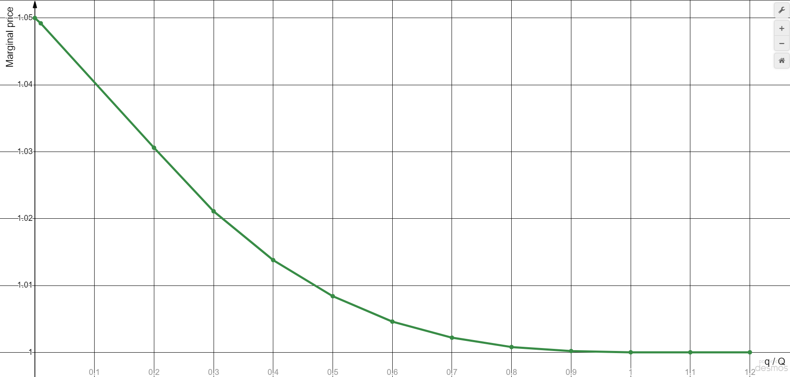
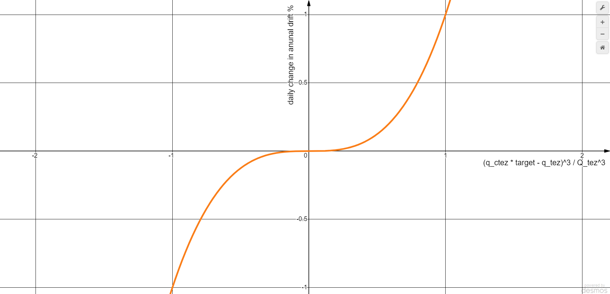
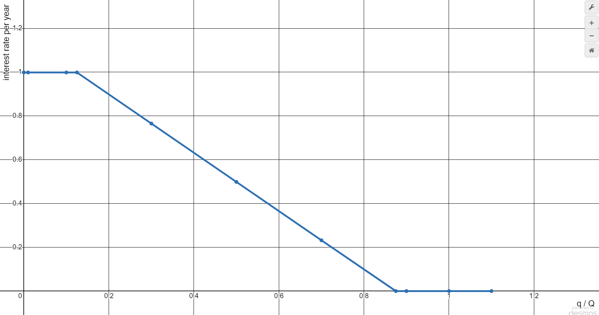

# Ctez2 Documentation

## High level description
Ctez is a synthetic version of tez designed to follow the price of the XTZ and automatically capture delegation rewards. While ctez can be used for e.g. DeFi purposes, users stay in control of their native tez tokens for governance and baking rewards. 

To do this, the user needs to create an oven, make a deposit in tez, choose a baker to delegate the locked deposit in the smart contract, and mint ctez for further use. To unlock the tez token, the user needs to select their oven, burn the ctez token, and withdraw their deposit in tez. Additionally, there is an option to exchange tez for ctez and vice versa on the built-in DEX.

The smart contract starts with a target price of 1 tez per 1 ctez and a drift of 0. Subsequently, with each action in the smart contract, the price and drift are recalculated, algorithmically ensuring the correct value of ctez. The target price is used throughout the smart contract (including the DEX and oven management) and has a significant impact on the protocol as a whole.

## Smart contracts

The Ctez2 project consists of three smart contracts: the Ctez Manager. Oven and the Ctez FA12 token.

The **Ctez Manager** is a monolithic smart contract that performs several functions: Ovens management and AMM (DEX). Additionally, this contract acts as the administrator for the Ctez FA12 token. The smart contract logic is located in the file *contracts/ctez/ctez_2.mligo* and is also divided into modules connected to this file.

The **Oven** smart contract is a small smart contract with functions such as depositing and withdrawing tez tokens, as well as delegating its balance to a chosen baker. Additionally, it provides the ability to edit the list of depositors and change the chosen baker.The smart contract logic is located in the file *contracts/oven.mligo* and is also divided into modules connected to this file.

The **Ctez FA12 token** smart contract is a standard token with a variable supply, and its logic is located in the file *contracts/fa12.mligo*.

## Ovens
Ovens are smart contracts created by the user through the main Ctez Manager contract. They are used to mint ctez tokens, which are loaned to the user (the oven owner) against collateral in the form of tez tokens. These tez tokens must be deposited and locked in the oven contract.

There is an option to burn ctez tokens and withdraw tez tokens. Additionally, the user can delegate the tez tokens locked in the oven contract to a chosen baker. The rewards from delegation are sent to the oven contract, increasing its balance.

The minimum amount of the deposit in tez tokens in an oven is calculated using the following formula:

`deposit_tez_amount = outstanding_ctez_amount * 16/15 * target_price`

In the event that the loan is under collateralized, the oven can be liquidated and anyone can grab the collateral by sending the outstanding ctez or fraction thereof to the vault. Additionally, a penalty of `1/32 * target_price * burned_ctez_amount` is deducted from the oven balance in favor of the liquidator.

## Dexes
The Ctez smart contract utilizes two unidirectional DEXs. The Sell Ctez Dex exchanges ctez for tez and accepts ctez tokens as liquidity. The Sell Tez Dex exchanges tez for ctez and accepts tez tokens as liquidity. In the source code, they are also referred to as half-DEXs. 

Each DEX is characterized by the following parameters: 

* total_liquidity_shares — total amount of liquidity shares;
* self_reserves — the amount of tokens available for sale (for SellCtezDex, self_reserves is the ctez token);
* proceeds_reserves — the amount of purchased tokens. (for SellCtezDex, proceeds_reserves is the tez token);
* subsidy_reserves — the amount of subsidies accumulated in ctez within the DEX;
* fee_index — the index required for calculating the subsidies to be collected from the ovens;

Each DEX also contains an accounting ledger for liquidity providers, with each entry consisting of the following fields:

* liquidity_shares — the amount of liquidity shares owned by the account;
* proceeds_owed — the amount of the proceeds token owed to the dex by the account;
* subsidy_owed — the amount of ctez subsidy owed to the dex by the account;

When a user provides liquidity to the DEX, they contribute only the self token. Since they haven’t contributed the corresponding share of proceeds and subsidy, they accumulate a debt based on their share. Upon removing liquidity, the user retrieves their share of self tokens along with their share of proceeds and subsidy, after subtracting the accumulated debt. It is also possible to withdraw only the proceeds and subsidy without removing the liquidity. This process is similar to the scenario where the user removes all liquidity and then re-adds the same amount of self tokens.

The DEX also allows exchanging self tokens for proceeds tokens. A user sends a certain amount of proceeds tokens and receives a corresponding amount of self tokens from the DEX. The marginal price of the self token is described by the following graph.

Where the x-axis represents the ratio *q/Q*. Where *q* is the dex liquidity amount (self_reserves amount), *Q* is the target liquidity amount. For sell ctez dex, *Q_ctez = 5%* of Ctez FA12 token total supply. For sell tez dex: *Q_tez = floor(Q_ctez * target_price)*.
The y-axis represents the coefficient by which the target_price is multiplied. In other words, the marginal price can range from *target_price*, to *1.05 * target_price*. When x > 1, y = 1, meaning that if dex liquidity amount > target liquidity amount, the marginal price is target_price.

See also [formula calculations](https://www.wolframcloud.com/obj/ffee73c9-aebd-44cc-9c84-5d73ac7a9096), [max error calculations](docs/marginal_price_error_calc.py)

## Target price, drift, subsidy
Each time any entry point is invoked in the Ctez Manager contract, the *do_housekeeping* function (located in *contracts/ctez/ctez_2.mligo*) is called. This function recalculates the following values in the storage: **target_price**, **drift**, and **subsidy_reserves** in each DEX.

### Target (target price / target peg)
The target represents the target peg between tez and ctez. A target of 1.5 means that the target peg is 1 ctez = 1.5 tez. Inasmuch as the ctez contract "tries" to do anything, it tries to automatically balance economic forces so that ctez is generally exchanged for tez at or around the target peg. The peg is only a target, there is no hard guarantee that, at any given time, ctez can be exchanged for tez at the target peg or vice-versa.

The target peg starts out at 1.0, meaning the smart-contract initially attempts to balance out incentives so that 1 tez is exchangeable for 1 ctez, but this changes over time. This is important, the target peg between tez and ctez is not fixed, it changes over time. It changes smoothly, predictably, and relatively slowly, but it changes. All else equal, at equilibrium this change may tend to compensate for the opportunity cost of delegation

### Drift
This is the most important number to pay attention to in ctez, it represents how quickly the target peg between ctez and tez increases or decreases. If the drift is positive, then the target peg is going to increase, if the drift is negative, the target peg is going to decrease.

The change in drift is calculated using the following formula:

`d_drift = (q_ctez * target_price - q_tez)^3 / Q_tez^3`

Where q_ctez is self token reserves in sell ctez dex, q_tez is self token reserves in sell tez dex, Q_tez is target amount of sell tez dex. Q_tez = floor(Q_ctez * target_price).  Q_ctez = 5% of Ctez FA12 token total supply.

The drift can change by as much as 1%/year every day.

### Subsidy
Subsidies are ctez tokens collected from each oven as a fee and accumulated in each DEXs separately as rewards for liquidity providers. Subsidies are charged only when there is insufficient liquidity in the DEXs, serving as an additional incentive for liquidity providers.

The fee rate depends on the actual liquidity in a dex and described by the following graph:

Where the x-axis represents the ratio q/Q. Where q is the dex liquidity amount (self_reserves amount), Q is the target liquidity amount. For sell ctez dex, Q_ctez = 5% of Ctez FA12 token total supply. For sell tez dex: Q_tez = floor(Q_ctez * target_price).

The y-axis represents the annual interest rate relative to the loan amount in each dex (outstanding_ctez). When x > 1, y = 0.

It is worth noting that the sum of outstanding_ctez in all ovens constitutes the total_supply of the ctez FA12 token. When the do_housekeeping function collects the next portion of subsidies, new ctez tokens are minted to the balance of the DEXs. Whenever an operation occurs in an oven, the amount of outstanding_ctez is increased by the amount of subsidies proportional to its share of the total_supply. In other words, it is as if subsidies were collected from each oven immediately, but for optimization purposes, subsidies are collected later, at the moment when an operation occurs in an oven.
